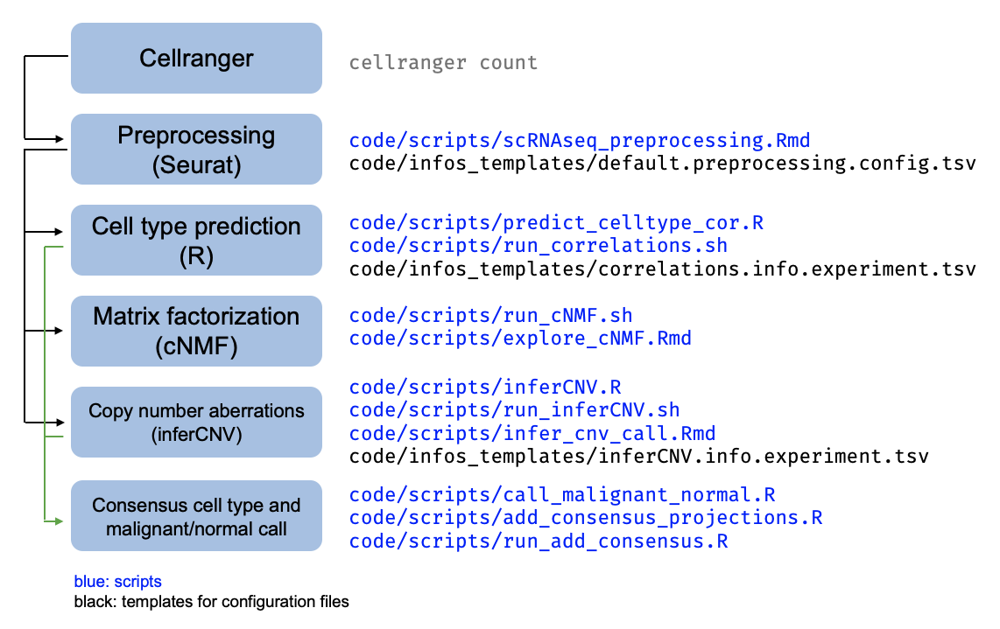
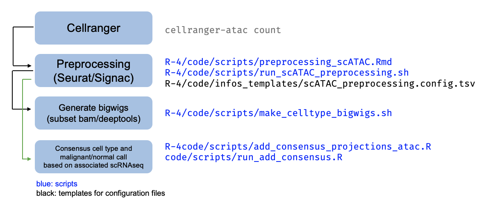
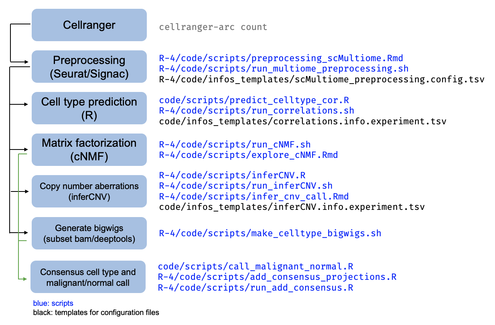

# HGG-oncohistones analysis code

This is the **public** repository accompanying the HGG-oncohistones manuscript.

Link to repository: https://github.com/fungenomics/HGG-oncohistones

This repository is archived on [Zenodo](https://doi.org/10.5281/zenodo.6647837).

Contents:
* [Contents of the repository](https://github.com/fungenomics/HGG-oncohistones#contents-of-this-repository)
* [Notes for reproducibility](https://github.com/fungenomics/HGG-oncohistones#notes-for-reproducibility)
* [Materials for the manuscript](https://github.com/fungenomics/HGG-oncohistones#materials-for-the-manuscript)
     * [Code to reproduce key analysies](https://github.com/fungenomics/HGG-oncohistones#code-to-reproduce-key-analyses)
     * [Palettes & custom plotting utilities](https://github.com/fungenomics/HGG-oncohistones#palettes--custom-plotting-utilities)
     * [Tables](https://github.com/fungenomics/HGG-oncohistones#tables)
* [Processed single-cell data](https://github.com/fungenomics/HGG-oncohistones#processed-single-cell-data)
     * [scRNAseq](https://github.com/fungenomics/HGG-oncohistones#single-cell-rnaseq-data)
     * [scATAC](https://github.com/fungenomics/HGG-oncohistones#single-cell-atacseq-data)
     * [scMultiome](https://github.com/fungenomics/HGG-oncohistones#single-cell-multiome-data)
     * [Cell annotations matching the paper](https://github.com/fungenomics/HGG-oncohistones#cell-annotations-matching-the-paper)
* [Re-analysis of human fetal brain scRNAseq data](https://github.com/fungenomics/HGG-oncohistones#human-fetal-brain-scrnaseq-data)
* [Citation](https://github.com/fungenomics/HGG-oncohistones#citation)

## Contents of this repository

This repository is meant to enhance the Materials & Methods section by providing code for the custom
analyses in the manuscript and the exact R dependencies, in order to improve reproducibility for the main results. However, it is not a fully executable workflow. It is structured as follows:

* `renv` --> renv-managed folder for R 3.6
* `renv.lock` --> lockfile containing all package versions for R 3.6 analysis
* `code` --> code for R 3.6 analysis, contains the .Rmd files that run the high-level analyses and produce figures included in the paper
   * `functions` --> contains .R files with custom functions used throughout the analysis
   * `scripts` --> contains .R and bash scripts for analyses that are repeated on individual samples, as well as helper scripts e.g. for creating references
   * `infos_templates` --> contains example config files for scripts in the `scripts` folder
* `R-4` --> code for R 4.1 analysis (has a similar directory structure as the above main directory)
   * `code` --> contains .Rmd files, functions, and scripts for R 4.1 analysis
   * `renv` --> renv-managed folder for R 4.1
   * `renv.lock` --> lockfile containing all package version for R 4.1 analysis
* `include` --> contains templates, palettes, etc, for this repository
* `rr_helpers.R` --> contains helper functions for working with this GitHub repository template ([`rr`](https://github.com/sjessa/rr))

## Notes for reproducibility

### `rr` template & helpers

This repository uses the [`rr`](https://github.com/sjessa/rr) template, which contains
a set of R markdown templates to help me ensure reproducibility. Secondly, this also
provides a set of helper functions (located in `rr_helpers.R` and prefixed by `rr_` in the
function name) to help encourage documentation.

### R and R package versions

The R libraries for this project are managed with the package [`renv`](https://rstudio.github.io/renv/index.html). 
The R versions used are 3.6.1 and 4.1.2, and `renv` manages one library
for each R version.

The `renv` package:

1. maintains two isolated project-specific libraries in the `renv` folder (for R 3.6.1) or `R-4/renv` folder (for R 4.1.2),
2. stores packages according to version
3. records the R, Bioconductor, and package versions in the file `renv.lock` (and `R-4/renv.lock`), which
can be used to reproduce the R package environment elsewhere

The reason for using two different R versions is that certain analyses involving
10X Multiome data require versions of Seurat/Signac dependent on R > 4.

### R Markdown

Each markdown/HTML file has a "Reproducibility report" at the bottom, indicating
when the document was last rendered, the most recent git commit when it was rendered,
the seed, and the R session info.

### Testing

Lightweight testing is performed in certain cases (e.g. validating metadata)
using the [ensurer](https://github.com/smbache/ensurer) package, combined with the
[testrmd](https://github.com/rmflight/testrmd) testing framework for R Markdown documents.
Certain reusable `ensurer` contracts (reusable tests) are stored in `./code/functions/testing.R`.

## GitHub / version control

This directory is tracked with git and has an associated GitHub repository in the Kleinman
lab account at https://github.com/fungenomics/HGG-oncohistones.

The following are tracked / available on GitHub:

* `.Rmd` files, containing the code, and `.md` files, containing code and outputs
* Certain output files (`tsv`/`Rda`/`Rds`), if they're small
* The brief `desc` files for outputs
* The lockfile produced by the `renv` package

The following are not tracked / available on GitHub:

* Figures in `png`/`pdf` format, and figure source data
* Raw data and analysis output / processed data files
* The actual packages in the R library 

## Materials for the manuscript

### Code to reproduce key analyses

Code to reproduce analyses is saved in `code` and `R-4/code`.
(See [here](https://github.com/fungenomics/HGG-oncohistones#r-and-r-package-versions) for why two different R versions are used.) When these analyses depend
on inputs from pipelines, I've tried to note within the R Markdown documents where
these scripts/pipelines are located.

Pointers to code for some key analyses:

| Analysis | Path |
| -------- | ---- | 
| Oncoprint | `./code/00-oncoprints.{Rmd,html}` |
| cNMF analysis of variable gene programs | `./R-4/code/02-celltype_identity.{Rmd,html}` |
| Cell type identity in tumors with consensus projections | `./R-4/code/04A-consensus_projections.{Rmd,html}` |
| Characterization of ependymal cells | `./code/01C-ependymal.{Rmd,html}` |
| Scatterplots for RNAseq/K27ac/K27me3 | `./code/02-bulk_comparisons.{Rmd,html}` |
| Systematic HOX analysis/quantification | `./code/03A-HOX.{Rmd,html}` |
| Analysis of D-V patterning | `./code/03B-hindbrain_DV.{Rmd,html}` |
| Analysis of thalamic patterning | `./code/04-thalamus.{Rmd,html}` |
| Analysis of histone marks in tumors & cell lines | `./code/07A-histone_marks.{Rmd,html}` |
| Comparison of tumor epigenomes to scChIP of normal cell types | `./R-4/code/05-celltype_epigenomic_similarity.{Rmd,html}` |

### Palettes & custom plotting utilities

Most color palettes (e.g. for tumor groups, genotypes, locations, cell types, HOX genes, etc) and ggplot2
theme elements (`theme_min()`, `no_legend()`, `rotate_x()`, etc) are defined in `./include/style.R`.

###  Tables

Supplementary tables (included with the manuscript) and processed data tables were assembled from the following input/output/figure source data files. (Only tables produced with the code included here are listed below.)

| Supplementary table | Path |
| ----- | ---- |
| 3 | `./output/00/TABLE_scRNAseq_QC.tsv` |
| 4 | `./output/00/TABLE_scATACseq_QC.tsv` |
| 5 | `./output/00/TABLE_scMultiome_QC.tsv` |
| 6 | `./output/05/TABLE_mouse_sample_info.tsv` |
| 7 | `./output/05/TABLE_mouse_cluster_info.tsv` |
| 8 | `./R-4/output/02/TABLE_cNMF_programs_per_sample.tsv` |
| 9 | `./R-4/output/02/cNMF_metaprogram_signatures.malignant_filt.tsv` |
| 10 | `./R-4/output/02/TABLE_reference_cnmf_program_overlaps.tsv` |
| 11 |  `./output/01A/TABLE_thalamus_QC.tsv` and `./output/01B/TABLE_hindbrain_QC.tsv` |
| 12 | `./output/01A/info_clusters3.tsv` and `./output/01B/info_clusters3.tsv` |
| 13 | `./output/03A/TABLE_HOX_expression_per_transcript.tsv` |
| 14 | `./output/03A/TABLE_HOX_H3K27ac_H3K27me3_per_transcript.tsv` |
| 16 | `./figures/03B/enhancer_diff-1.source_data.tsv` |

| Processed data table | Path | 
| ----- | ---- |
| 1a | `./output/02/TABLE_bulk_counts.tsv` |
| 1b | `./output/02/TABLE_dge_H3.1_vs_H3.3.tsv` |
| 1c | `./output/02/TABLE_dge_thal_vs_pons.tsv` |
| 2a | `./output/07A/TABLE_K27me3_CGIs.tsv` |
| 2b | `./output/07A/TABLE_K27me2_100kb_bins.tsv` |
| 3a | `./output/02/TABLE_promoter_H3K27ac_H3K27me3_per_sample.tsv` |

## Processed single-cell data

This section describes the scripts used for preprocessing of single-cell
data from this project. That includes: sn/scRNAseq, scATACseq, and scMultiome
(joint RNA & ATAC in the same cells). This document refers to sn and scRNAseq generally as 'scRNAseq'. Please see the sample metadata for the technology used to profile each sample. Please see the Methods section of the manuscript for more details on the single-cell profiling.

### Single-cell RNAseq data

The pipeline for scRNAseq processing applied per-sample is summarized in this schematic. In general, `scripts` contain the code to run the analysis and `config` files contain the parameters or setting specific to a certain iteration of the analysis.

Following Cellranger, the scRNAseq samples have all been processed with the
lab's preprocessing workflow (`./code/scripts/scRNAseq_preprocessing.Rmd`).
Each sample is then subject to several downstream analyses as described in the schematic above,
with the associated scripts indicated.

### Single-cell ATACseq data

The pipeline for scATACseq processing applied per-sample is summarized in this schematic:

Following Cellranger, preprocessing of the scATAC data is done with a script that
builds off the scRNAseq workflow, at `./R-4/code/scripts/preprocessing_scATAC.Rmd`.
This workflow is run in the scATAC pipeline at `./R-4/data/scATACseq/pipeline_10X_ATAC`,
with one folder per sample. Each sample is then subject to several downstream analyses
as described in the schematic above, run in that sample's folder, with the associated scripts.

### Single-cell Multiome data

The pipeline for scMultiome processing applied per-sample is summarized in this schematic:

Following Cellranger, preprocessing of the scMultiome data is done with a script that builds off the scRNAseq workflow, at `./R-4/code/scripts/preprocessing_scMultiome.Rmd`.
This workflow is run in the scMultiome pipeline at `./R-4/data/scMultiome/pipeline_10X_Multiome`, with one folder per sample. Each sample is then subject to several downstream analyses
as described in the schematic above, run in that sample's folder, with the associated scripts.

### Cell annotations matching the paper

For scRNAseq, scATACseq and scMultiome samples, the cell metadata provided with the paper contains several
columns matching the analyses used in the paper:

* `Cell_type_granular_mouse_correlations` --> cell-type projection to the extended mouse atlas, based on the Spearman correlation, using the cluster label (REGION-TIMEPOINT_CLUSTER)
* `Cell_type_mouse_correlations` --> cell-type projection to the extended mouse atlas, based on the Spearman correlation, summarized to a broader cell class (ontology is described in Table S3B)
* `Cell_type_consensus_Jessa2022`--> consensus cell-type projection to the extended mouse atlas, based on agreement between Spearman correlation and at least one other cell-type projection method. Cells without a consensus are classified as "Uncertain".
* `Malignant_normal_consensus_Jessa2022` --> assignment as normal or malignant, used to decide whether cells should be included in downstream analyses

The cell annotations/metadata are included in the processed data deposition.

### Human fetal brain scRNAseq data

Human fetal data brain data for the hindbrain and thalamus were obtained from two
studies, Eze et al, Nature Neuroscience, 2021, and Bhaduri et al, Nature, 2021.

- The count matrices for each sample, as produced by Cellranger, were downloaded from the [BICCN repository](http://data.nemoarchive.org/biccn/grant/u01_devhu/kriegstein/transcriptome/scell/10x_v2/human/processed/counts/).
- The data was processed using the scRNAseq preprocessing workflow as described above for human tumor samples (`./code/scripts/scRNAseq_preprocessing.Rmd`)
- Thalamic samples were labelled using the published cluster labels, together with manual correction based on known cell type markers (performed in `./code/01A_2-human_thalamus.{Rmd,html}`)
- Hindbrain samples were labelled by projection to the mouse atlas (described in `./code/01B-human_hindbrain.{Rmd,html}`)

## Citation

If you use or modify code provided here, please cite this work as follows:

> Selin Jessa, Steven Hébert, Samantha Worme, Hussein Lakkis, Maud Hulswit, Srinidhi Varadharajan, Nisha Kabir, and Claudia L. Kleinman. (2022). HGG-oncohistones analysis code. Zenodo. https://doi.org/10.5281/zenodo.6647837

