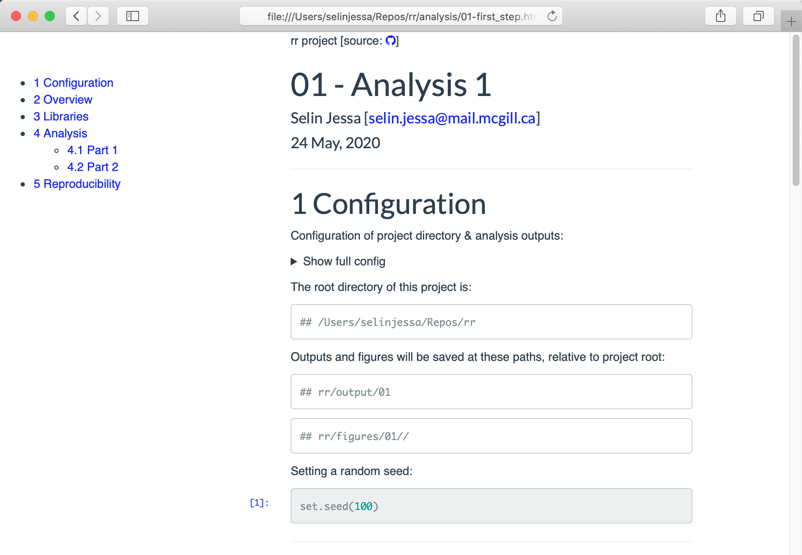
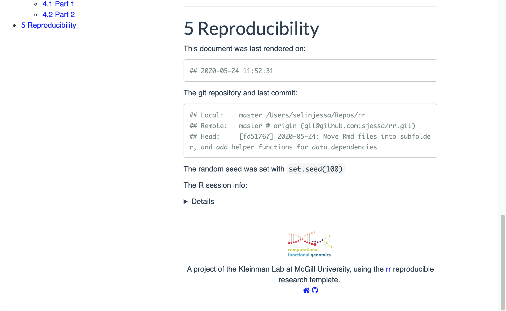
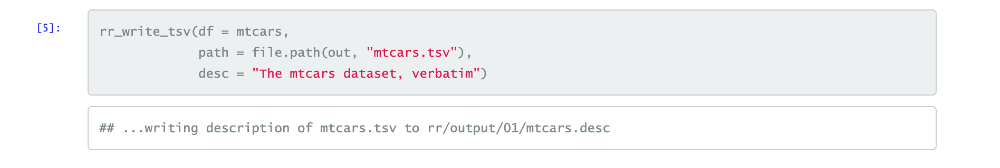
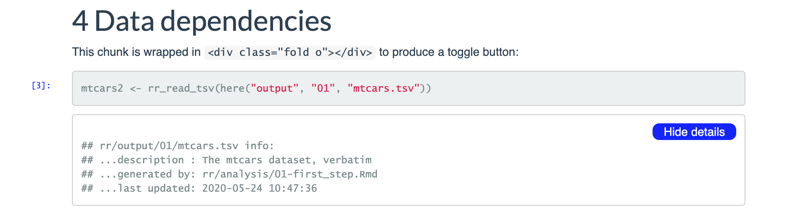
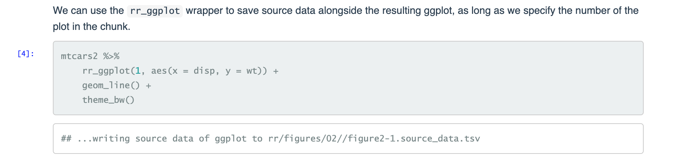
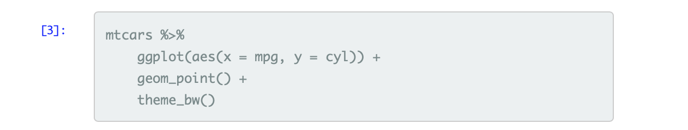
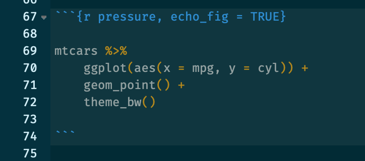
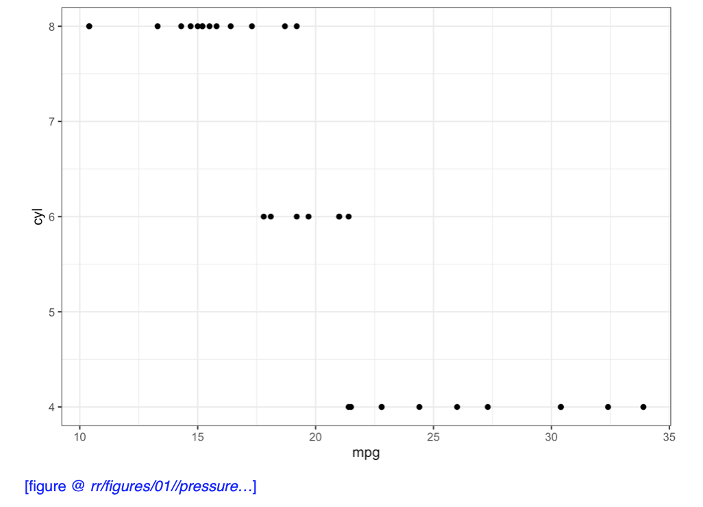
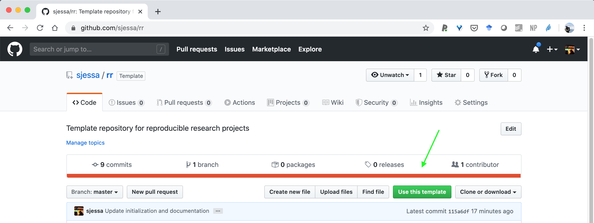

# rr

A template repository for reproducible research projects  
:pencil2: :chart_with_upwards_trend: :notebook: :bar_chart: :microscope: :computer: :octocat:

Check out the example rendered HTML files

1. [Step 1](https://sjessa.github.io/rr/analysis/01-first_step.html) of an analysis, which generates some output
2. [Step 2](https://sjessa.github.io/rr/analysis/02-second_step.html) of an analysis, which loads the output from document `01`

### Contents:

* [Features](https://github.com/sjessa/rr#features)
* [Requirements](https://github.com/sjessa/rr#requirements)
* [Usage](https://github.com/sjessa/rr#usage)

### Features

* A header with the project source link
* :gear: A configuration section at the beginning of each Rmd, which specifies the 
project directory the paths to the outputs, and seed which is automtically set:

 
 

* :hammer_and_wrench: A reproducibility section at the end of each Rmd, which prints out 
key information for reproducing the analysis, like the time the document was last
rendered, the last commit in the git repository, and the R session info:
* A custom footer with lab logo & link, and link to the `rr` template repository

 
 

* Helper functions for writing TSVs & R objects with a concise description, and loading
that description & some file info when reading the TSV / loading the R object

_Make output_

_Load output_

* Helper functions for saving source data when generating figures with ggplot2:

* Chunk numbering

* Printing the output path of figures, based on the chunk name:

### Requirements

* :package: [`{here}`](https://cran.r-project.org/web/packages/here/index.html) package
* :package: [`{readr}`](https://readr.tidyverse.org/) package
* :package: [`{git2r}`](https://cran.r-project.org/web/packages/git2r/index.html) package

Highly recommended:

* :package: [`{renv}`](https://rstudio.github.io/renv/index.html)

### Usage:

1. On GitHub, click the "Use this template button"

2. Follow the instructions to make a new repository, and clone it to your machine

3. Source the `rr_helpers.R` file by running `source("rr_helpers.R")`, from the
root of the project directory, and run `rr_initialize()`, following the prompts
to clean up the repository for first use, and customize the template.

4. To start new analyses, copy `include/template.Rmd` to the `analysis` folder,
and code away!

5. Whenever you make changes, commit them with git and push to the remote.

6. :rocket: Profit!
